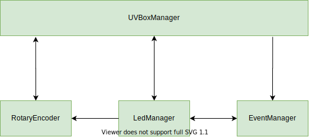
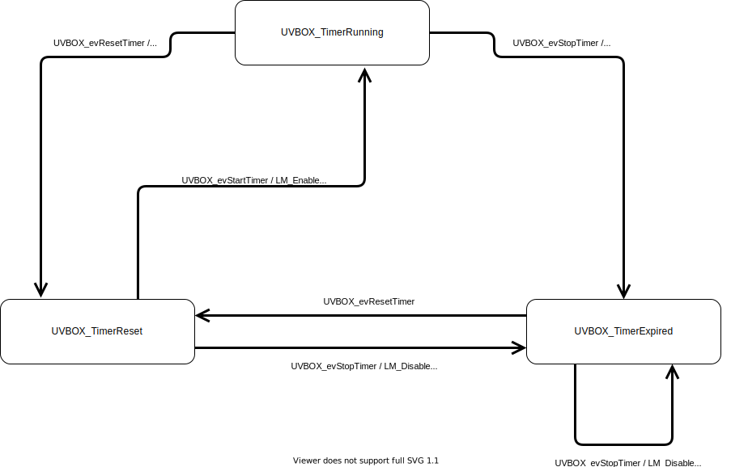

## UV Lightbox

UV lightbox with adjustable LED brightness.

The lid uses a momentary switch to detect when the lid is closed or open.
- When lid is open, only the LED stips will turn on, allowing safe preparation of negatives.
- When lid is closed, only the UV LED panels will turn on.

### Software Overview

- UVBoxManager inits user application and coordinates input control interrupts.
- EventManager implements a simple state machine.
- LedManager controls the LED PWM for the two modes.

__System overview__

__System behavior__

- When the lid is closed the timer starts its countdown.
- When the countdown has expired, the lid must be opened to reset the timer. This prevents the timer from restarting in a loop before the lid is opened.

__Hardware Overview__

For hardware details see project: [UV_LED_DRIVER](https://github.com/cracked-machine/UV_LED_Driver/tree/master/UV_LED_Driver_Modular)
